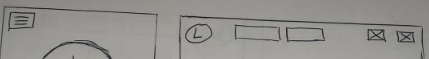
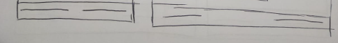
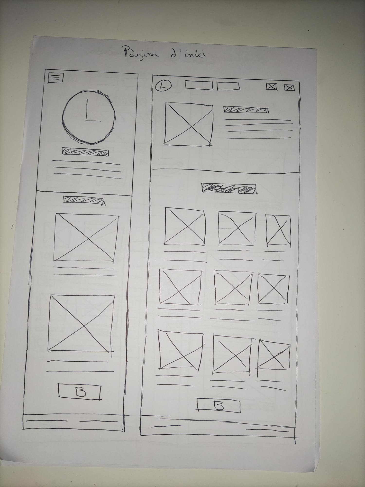
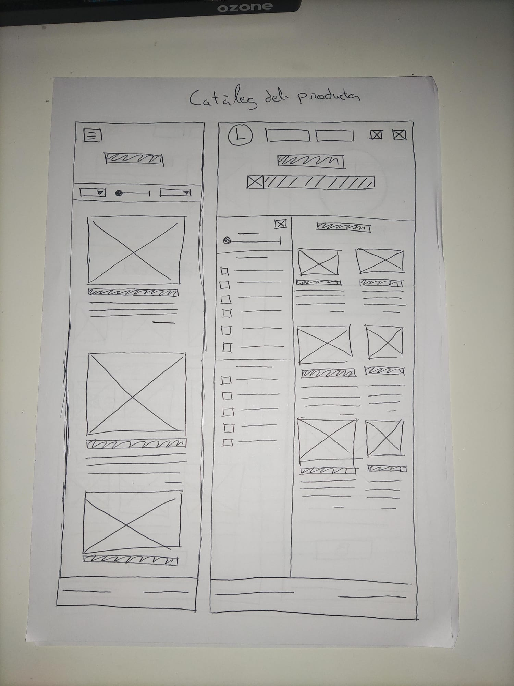
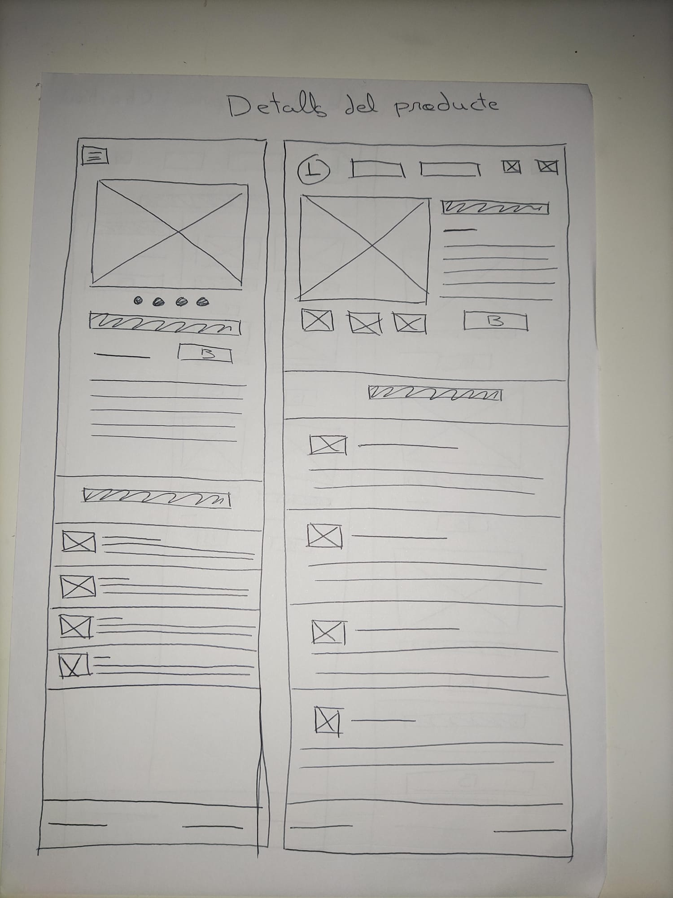
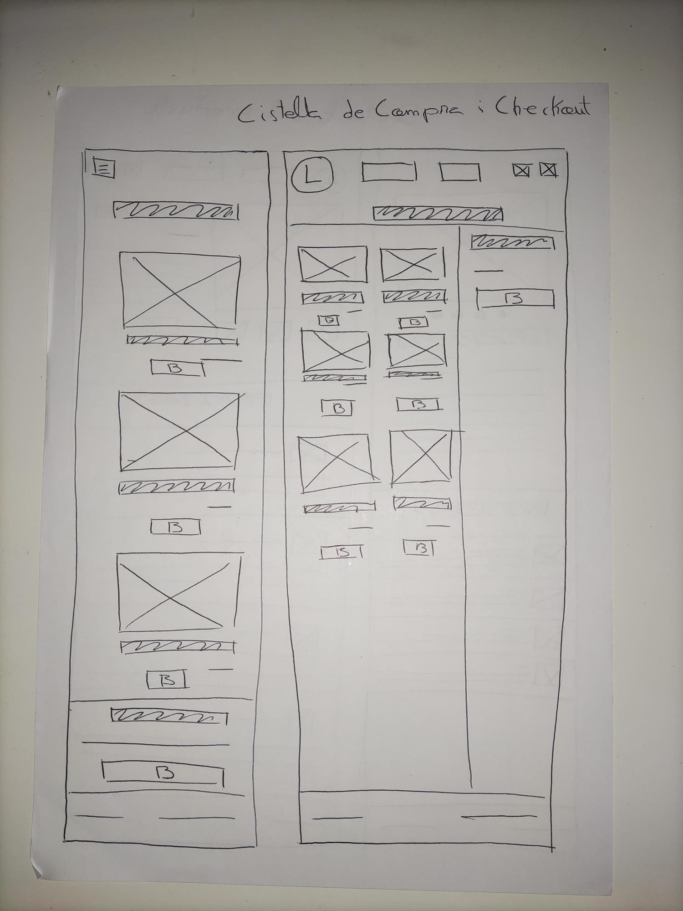
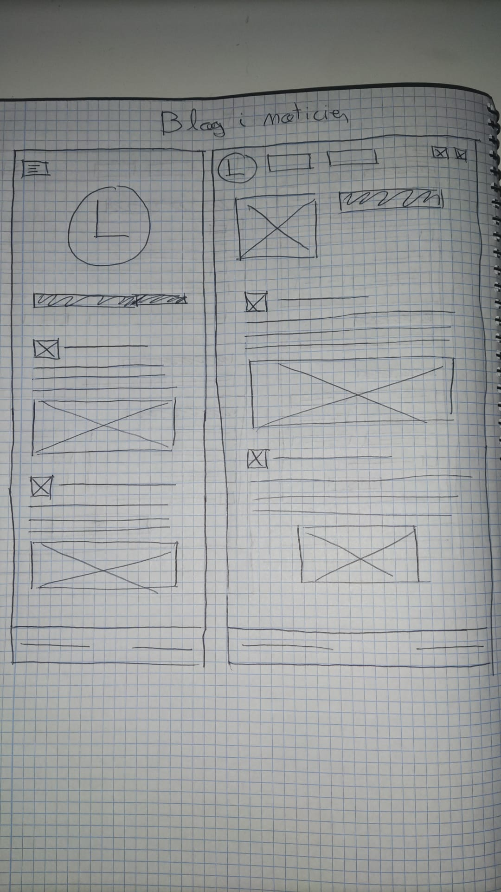

# P0_wireframe

## Objetivo
Este proyecto tiene como objetivo la creación de wireframes de baja fidelidad (BF) para un E-commerce que vende guitarras de lujo. El trabajo se ha realizado de manera colaborativa entre perfiles DAW y DAM, donde ambos se encargan del diseño orientado a la web y multiplataforma respectivamente.

## Integrantes
- **Enlace GitHub**: https://github.com/danistrix63/P0_wireframe.git
- **DAM**: Daniel Dans
- **DAW**: Victor Merino

## Descripción del Proyecto
El cliente, un empresario autónomo, necesita una tienda en línea para la venta de guitarras de lujo. Se le ofrecen dos wireframes, uno para la pagina web y el otro para la aplicación.

## Parte DAM

### Primer DIN A4

#### Página de Inicio
En la parte superior del primer DIN A4, se encuentra la **Página de Inicio**. Esta página es la entrada principal a la aplicación y tiene los siguientes elementos clave:

- **Header**: Contiene un logotipo en la esquina izquierda, y en la derecha los botones de login y de acceso al carrito de compras, permitiendo al usuario registrarse o iniciar sesión rápidamente y visualizar los productos añadidos al carrito.
- **Productos Destacados**: Se muestra una galería de guitarras de lujo destacadas. Esta sección permite al usuario desplazarse horizontalmente para ver las ofertas más relevantes, captando su atención desde el inicio.
- **Sección de Acceso a Productos**: Debajo de los productos destacados, se incluye un enlace que lleva al catálogo completo de productos. Este enlace es crucial para guiar al usuario hacia la sección donde puede explorar todas las guitarras disponibles.

#### Catálogo de Productos
En la parte inferior del primer DIN A4, se presenta el **Catálogo de Productos**, que es la sección donde el usuario puede explorar las diferentes guitarras de lujo en venta.

- **Listado de Productos**: Se presenta un grid con imágenes de las guitarras, acompañadas de una breve descripción y el precio de cada una. La disposición en formato grid optimiza el espacio disponible en la pantalla y permite al usuario visualizar múltiples productos a la vez.
- **Filtros**: En el lateral izquierdo de la pantalla, se encuentran los filtros por marca, tipo de guitarra y rango de precios. Los filtros permiten una búsqueda más precisa y adaptada a las necesidades del usuario, mejorando la experiencia de navegación.
- **Footer con Contacto**: En la parte inferior se ha reservado un espacio para el contacto, permitiendo al usuario acceder fácilmente a información adicional o soporte en caso de ser necesario.

### Segundo DIN A4

#### Detalles del Producto
En la parte superior del segundo DIN A4, se muestra la página de **Detalles del Producto**. Esta página está diseñada para que el usuario obtenga más información sobre un producto en particular.

- **Imagen Principal**: Se muestra una imagen grande y destacada de la guitarra seleccionada, acompañada por una serie de miniaturas debajo, permitiendo al usuario ver diferentes ángulos o versiones del producto.
- **Especificaciones y Reseñas**: Debajo de las imágenes se presenta una lista con las especificaciones técnicas de la guitarra (como materiales, tipo de cuerdas, etc.), y una sección de reseñas donde los clientes pueden dejar su opinión.
- **Formulario de Inserción de Productos**: En esta sección, los administradores o el equipo encargado pueden subir nuevas guitarras a la tienda. Incluye campos para ingresar el nombre, descripción, precio y cargar las imágenes correspondientes.

#### Cistella de Compra y Checkout
La parte inferior del segundo DIN A4 presenta la **Cistella de Compra y el Proceso de Checkout**. Esta sección está dedicada a la gestión de los productos que el usuario ha añadido a su carrito y el proceso de finalización de compra.

- **Carrito**: Se muestra una lista con las guitarras seleccionadas, indicando el precio y la cantidad de cada producto. El usuario tiene la posibilidad de modificar la cantidad o eliminar productos directamente desde esta página.
- **Checkout**: Incluye un resumen del total de la compra, aplicando cupones de descuento si es necesario, y el proceso de selección del método de pago, garantizando una experiencia de compra fluida y segura.

### Tercer DIN A4

#### Autenticación y Registro de Usuarios
En la parte superior del tercer DIN A4, se detalla el **Proceso de Autenticación y Registro de Usuarios**, que es fundamental para que los clientes puedan realizar compras y gestionar su cuenta.

- **Formulario de Registro**: Los usuarios pueden crear una nueva cuenta proporcionando su nombre, correo electrónico, y una contraseña segura. También incluye una confirmación de contraseña para evitar errores de ingreso.
- **Formulario de Login**: Para los usuarios registrados, se les permite iniciar sesión ingresando su correo y contraseña. También se incluye una opción para iniciar sesión mediante Google, simplificando el proceso de autenticación.
- **Recuperación de Contraseña**: En caso de olvidar la contraseña, se ofrece una opción para recuperarla mediante el correo electrónico, mejorando la usabilidad y accesibilidad de la aplicación.

#### Blog y Noticias
La parte inferior del tercer DIN A4 presenta la sección de **Blog y Noticias**.

- **Añadir Entrada al Blog**: Esta parte de la aplicación está destinada a los administradores o colaboradores que desean publicar contenido relacionado con guitarras, novedades del sector o consejos para los clientes. El formulario incluye un campo para el título y una caja de texto donde se redacta el contenido del artículo.
- **Noticias Publicadas**: Los usuarios pueden consultar las últimas entradas publicadas en el blog. Esta sección permite mantener actualizados a los clientes con contenido relevante y fortalecer el vínculo entre la tienda y los aficionados a las guitarras.

# Part DAW

## Header i footer

### Header
A la versió mòbil, el header inclou un menú desplegable. A la versió d'escriptori, consta d'un logotip a l'esquerra que enllaça a la pàgina d'inici, dos enllaços principals: un pel catàleg de productes i un altre pel blog i notícies. Finalment, a la dreta, hi ha dues icones amb enllaços: una per accedir a la cistella i l'altra per a la secció d'usuari.

### Footer

El footer es igual a les dues versions i conté dos textos: un per el correu electrònic i l’altre amb el número de telèfon

## Pàgina d'inici

La pàgina d'inici consta de dues parts, la presentació de la botiga i una mostra dels productes destacats.

### Presentació de la botiga

A la versió de mobil, hi ha el logo en gran al centre de la pantalla i segit d'aquest el titol i la descripció.

A la versió d'ordinador hi ha una imatge a l'esquerra de la pantalla i a la dreta el titol i segit la descripció.

### Productes destacats

A la versió de mobil, hi ha el titol de la secció i segit una columna amb productes destacats. Cada producte inclou una imatge, el nom en format de text i una breu descripció just a sota. Al final de la secció, hi ha un botó per veure més productes.

A la versió d’ordinador, es mostra el títol de la secció seguit d’una graella autoajustable amb files i columnes que conté els productes destacats. Cada producte inclou una imatge, el nom en text i una descripció breu a sota. Al final de la secció, hi ha un botó per veure més productes.

## Catàleg dels productes

La pàgina consta de dos seccions, la presentació i el catàleg.

### Presentació

A la versió de mobil, nomès hi ha un titol al centre

a la versió d'ordinador hi ha un titol i un input per cercar productes

### Catàleg

El catàleg conté:
 - Filtre de productes per marca preu i tipus de guitarra
 - Productes
    - Imagte
    - Titol per el nom
    - Text per la descripció
    - text per el preu

A la versió de mobil, el filtre es troba a la part superior de la secció i els filtres són 2 desplegables i un input de tipus range. A sota es troben els productes un asota de l'altre.

A la versió d'ordinador, el filtre es troba a la part esquerra de la secció i esta compost per un input tipus range per el preu i diversos inputs tipus check per les marques i els tipus de guitarres.
A la dreta es traba una graella autoajustable per els productes.

## Detalls del producte

Aquesta pàgina consta de: 
 - Detalls del producte
    - Carrosell d'imatges
    - Titol amb el nom del producte
    - Text amb el preu
    - Text amb la descripció
    - Botó per afegir a la cestella
 - Opinions del clients
    - Imatge del usuari
    - Nom del usuari
    - Text de la opinió

### Detalls del producte

A la versió de mobil, el carrosell d'imatges es troba la part superior segit del nom, el preu, botó d'afegir i la descripció.

A la versió d'ordinador, el carrosell d'imatges es troba a la part esquerra i a la dreta es troben el nom, el preu, la descripció i el botó d'afegir.

### Opinions dels clients

La versió de mobil i ordinador són iguals, cada opinió es troba una a sota de l'atre.

## Cistella de compra

Aquesta pàgina esta composta per:
 - Llista de productes
    - Imatge
    - Nom
    - Preu
    - Botó per eliminar
 - Confiramció de compra
    - Titol
    - Preu total
    - Botó per comprar

### Llista de productes

A la versió de mobil els productes es troben un a sota de l'altre.

A la versió d'ordinador els productes estan en una graella autoajustable.

### Confirmació de compra

A la versió de mobil la confiramció es troba a la part superior de la pantalla de manera fitxa.

A la versió d'ordinador la confirmació es troba a la part dreta de la pantalla de manera fitxa.

## Checkout

Aquesta pàgina es exactament igual a les dues versions i conte aquestes parts:

 - Titol
 - Checks per seleccionar el metode de compra
    - Input per el titular
    - Input per el numero de la tarjeta
    - Input per el cvc
    - Input per la data de caducitat
 - Input per el correu electronic
 - Titol per l'apartat de la adreça
 - Input de la adreça
 - Input de la direcció
 - Input del codi postal
 - Input de la ciutat
 - Input del pais
 - Check per guardar adreça
 - Botó de compra

## Autencificació i Registre

La pàgina de login i la de registre tenen la mateixa estructura:
 - Formulari
    - Logo
    - Titol
    - Label usuari
    - Input usuari
    - Label contrasenya
    - Input contrasenya
    - Enllaç a la pàgina de Registre / Login
    - Enllaç per recuperar contrasenya

## Recuperar cotrasenya

Aquesta pàgina es identica a la versió de mobil i ordinador:
 - Formulari
    - Label nova cotrasenya
    - Input nova contrasenya
    - Label repetir contrasenya
    - Input repetir contrasenya

## Formulari per afegir productes

Aqusta pàgina consta de dues parts:
 - Formulari
    - Lable nom
    - Input nom
    - Label preu
    - Input preu
    - Label descripció
    - Input descripció
    - Label imatges
    - Input imatges
    - Botó per afegir
 - Previsualització del producte
    - Imatges
    - Titol amb el nom
    - Preu
    - Descripció

### Formulari

A la verisió de mobil el formulari ocupa tota la pàgina

A la versió d'ordinador el formulari es troba a la part dreta de la pàgina.

### Previsualització

A la versió de mobil no hi ha previsualització.

A la versió d'ordinador, la previsualització es troba a la part esquerra.

## Blog i noticies

Aquesta pàgina consta de dues parts:
 - Presentació
 - Publicacions
    - Imatge usuari
    - Nom usuari
    - Text
    - Imatges

### Presentació

A la versió de mobil hi ha el logo al centre de la pantalla i a sota el titol de la secció

A la versió d'ordinador hi ha una imatge a la dreta i a l'esquerra el titol de la secció

### Publicacions

Les dues versions son iguals.

